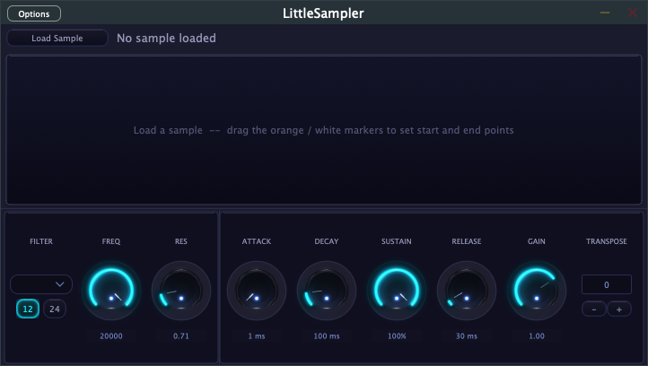

# LittleSampler

A compact, polyphonic sampler plugin built with JUCE 8 — inspired by Ableton Simpler.  
Load any audio file, trim it with visual markers, shape it with an ADSR envelope and filter, and play it chromatically across your MIDI keyboard.



---

## Features

- **Sample loading** — WAV, AIF, AIFF, MP3, FLAC
- **Waveform display** — visual overview of the loaded sample
- **Start / End markers** — drag the orange (start) and white (end) markers directly on the waveform to set the playback region
- **ADSR envelope** — Attack, Decay, Sustain, Release with live readout (ms / %)
- **Filter** — LPF or HPF with 12 dB/oct or 24 dB/oct slope, frequency and resonance knobs
- **Gain** — per-sample trim (0–2×)
- **Fade-in** — removes clicks at the sample start point
- **Transpose** — shift all notes ±24 semitones
- **8 polyphonic voices** — full chromatic pitch tracking (middle C = original pitch)
- **Formats** — VST3, AAX, Standalone

---

## Requirements

| Dependency | Version |
|---|---|
| [JUCE](https://juce.com) | 8.x |
| CMake | 3.22+ |
| Xcode / Apple Clang | macOS 12+ |

> The JUCE source is expected at `/Users/<you>/code/JUCE`. Update the path in `CMakeLists.txt` if yours differs.

---

## Build

```bash
# 1. Configure (first time only)
cmake -B build -DCMAKE_BUILD_TYPE=Debug

# 2. Build & launch Standalone
./build-and-run.sh
```

`build-and-run.sh` incrementally builds only changed files (~3–5 s for UI edits) and re-launches the Standalone app automatically.

---

## Controls

### Waveform
| Action | Result |
|---|---|
| Drag orange triangle | Move start point |
| Drag white triangle | Move end point |
| Load new sample | Markers reset to full range |

### Filter
| Control | Range | Default |
|---|---|---|
| Type | LPF / HPF | LPF |
| Slope | 12 dB / 24 dB | 12 dB |
| Freq | 20 Hz – 20 kHz | 20 kHz (open) |
| Res | 0.1 – 5.0 | 0.71 |

### Envelope
| Control | Range | Default |
|---|---|---|
| Attack | 1 ms – 5 s | 1 ms |
| Decay | 1 ms – 5 s | 100 ms |
| Sustain | 0 – 100 % | 100 % |
| Release | 1 ms – 10 s | 30 ms |

### Other
| Control | Range | Default |
|---|---|---|
| Gain | 0 – 2× | 1.0 |
| Fade | 0 – 200 ms | 0 ms |
| Transpose | −24 – +24 st | 0 |

---

## Project Structure

```
LittleSampler/
├── Source/
│   ├── PluginProcessor.cpp/h   — Audio engine, ADSR, filter, MIDI, state
│   └── PluginEditor.cpp/h      — UI, waveform, knobs, look & feel
├── Resources/
│   └── knobStrip.png           — 128-frame PNG sprite sheet for knobs
├── docs/
│   └── screenshot.png
├── CMakeLists.txt
└── build-and-run.sh
```

---

## License

MIT
